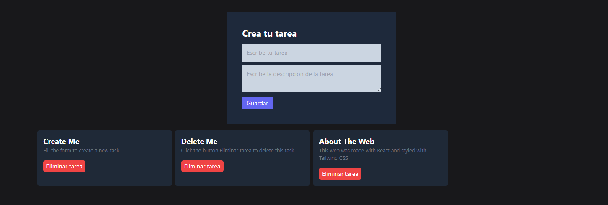

# TaskList App
The TaskList App is a simple application that allows you to add and delete tasks. The existing tasks are taken from a JSON file located within the same project. The purpose of this project is educational, aimed at teaching the basics of React.

## Features
- Add new tasks to the list
- Delete tasks from the list
- View a list of existing tasks

## Technologies
The TaskList App is built using the following technologies:

- React
- Vite
- JavaScript
- HTML
- CSS
- Tailwind

## How to Use
To use the TaskList App, you'll need to follow these steps:

1. Clone the repository to your local machine
2. Install the required dependencies by running `npm install`
3. Start the app by running `npm run dev`
4. Navigate to `http://localhost:3000` in your web browser
5. Add and delete tasks as needed

## How to Contribute
If you're interested in contributing to the TaskList App, please follow these guidelines:

1. Fork the repository
2. Make your changes on a new branch
3. Submit a pull request with a detailed description of your changes
4. Wait for the maintainers to review and approve your changes